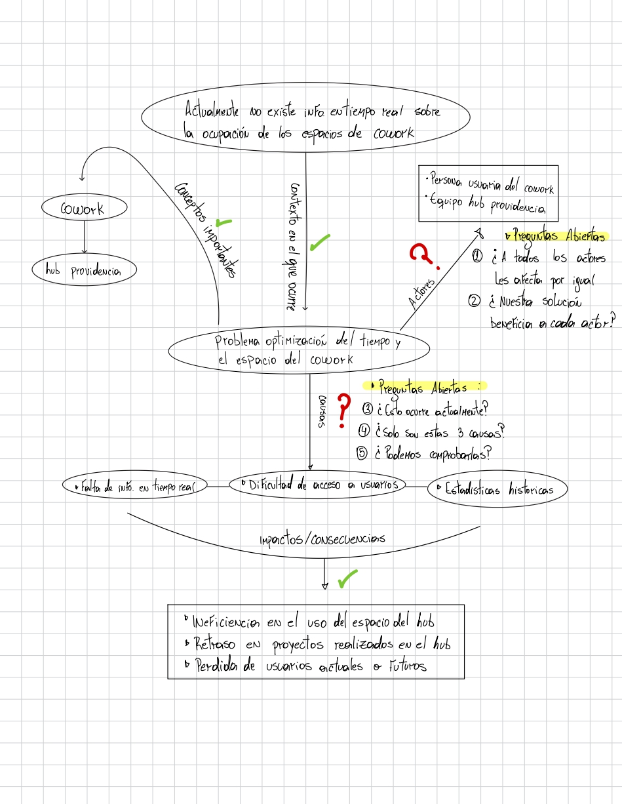
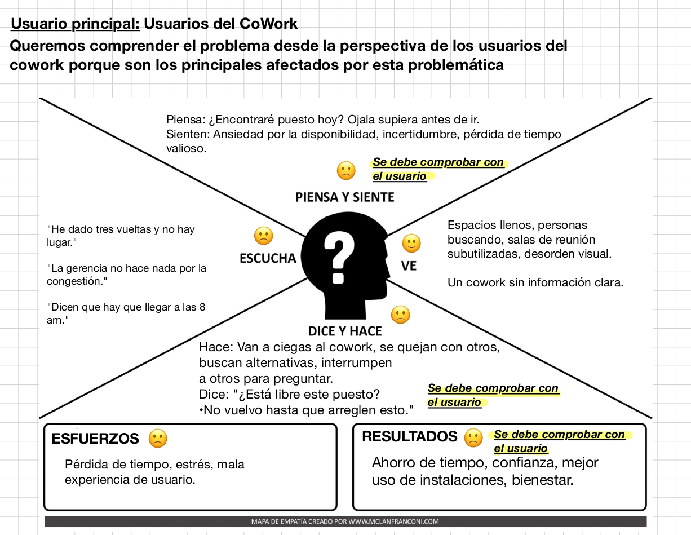

# S03 - Comprensión del Problema: Mapa Conceptual, Mapa de Empatía y Comunicación Oral
* **Fecha:** 27 de agosto de 2026
* **Participantes:** Alonso Contreras, Alan Avila, Maikol Cisternas, Mara Romero

---

## 1. Objetivo de la Sesión
Comprender a profundidad la problemática del Desafío 03 (Hub Providencia) mediante la elaboración de un Mapa Conceptual y un Mapa de Empatía, identificar supuestos a validar y ejercitar habilidades de comunicación oral para la preparación del Pitch del Hito 1.

---

## 2. Mapa Conceptual del Desafío

### Desglose del Problema
* **Desafío Central:** Falta de información en tiempo real sobre la ocupación de los espacios de cowork en el Hub Providencia, afectando la optimización del tiempo y del espacio.
* **Actores involucrados:** 
  * Personas usuarias del cowork.
  * Equipo de gestión del Hub Providencia.
* **Impactos y Consecuencias:**
  * Dificultad e ineficiencia en el uso del espacio del Hub.
  * Pérdida de tiempo valioso para los usuarios.
  * Retraso en proyectos realizados dentro del cowork.
  * Posible pérdida de usuarios actuales o futuros debido a la mala experiencia.

### Clasificación: Sabemos vs. Necesitamos Saber
* **Lo que sabemos (con evidencia):** Que no existe un sistema actual de monitoreo en tiempo real e instalaciones congestionadas en ciertos horarios.
* **Lo que necesitamos saber (supuestos/dudas):** Patrones exactos de tráfico, causas específicas de la congestión y qué métricas valora más la administración.

### 5 Preguntas Abiertas Generadas
1. ¿Cómo ocurre actualmente la gestión y distribución de espacios dentro del cowork?
2. ¿A todos los actores (usuarios y administración) les afecta el problema por igual?
3. ¿De qué manera nuestra solución beneficia específicamente a cada tipo de actor?
4. ¿Existen otras causas asociadas a la falta de información de ocupación además del acceso?
5. ¿Podemos comprobar y medir de forma precisa los patrones de uso actuales con la tecnología disponible?

---

## 3. Mapa de Empatía

* **Usuario Principal:** Usuarios del CoWork.
* **Declaración de Propósito:** *"Queremos comprender el problema desde la perspectiva de los usuarios del cowork porque son los principales afectados por esta problemática."*

### Quadrantes de Empatía
* **¿Qué piensa y siente?:**
  * *Piensa:* "¿Encontraré puesto hoy? Ojalá supiera antes de ir."
  * *Siente:* Ansiedad por la disponibilidad, incertidumbre y frustración por la pérdida de tiempo.
* **¿Qué ve?:** Espacios llenos, personas buscando lugar desesperadamente, salas de reunión subutilizadas y desorden visual. Un cowork sin información clara.
* **¿Qué oye?:** "He dado tres vueltas y no hay lugar", "La gerencia no hace nada por la congestión", "Dicen que hay que llegar a las 8 am".
* **¿Qué dice y hace?:**
  * *Hace:* Van a ciegas al cowork, se quejan con otros usuarios, buscan alternativas externas o interrumpen a otros para preguntar por espacios.
  * *Dice:* "¿Está libre este puesto?", "No vuelvo más hasta que arreglen esto".
* **Esfuerzos (Pains):** Pérdida de tiempo transportándose a ciegas, estrés e incertidumbre, mala experiencia de usuario.
* **Resultados (Gains):** Ahorro de tiempo, confianza en el servicio, mejor aprovechamiento de las instalaciones del Hub y bienestar general.

### 3 Supuestos Críticos a Validar con Usuarios
1. **Supuesto 1:** Los usuarios prefieren revisar la disponibilidad desde una plataforma digital antes de salir de sus casas u oficinas.
2. **Supuesto 2:** La falta de visibilidad en tiempo real provoca que usuarios abandonen el cowork o busquen alternativas.
3. **Supuesto 3:** Existe una frustración directa acumulada hacia la gestión del Hub por no saber la ocupación exacta de salas y puestos.

---

